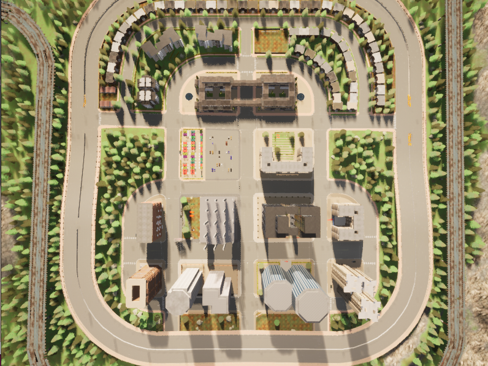

# M202A-CARLA

## Basic Setup on Lab Computer

⚠️ Assumes that the Docker image exists already. 

1. Create / start the development container (assumes image exists already):

```bash
./create_dev_cont.sh autocommit
```

# WARNING
Do not run the above command (in step 1) on Vamsi's desktop. Instead use `./run_cont.sh`.

2. Setup and run the CARLA simulator:

```bash
cd /home/erdos/workspace/M202A-CARLA
. ./start_carla.sh
```

2. Load map
```bash
python load_town5.py
```

Run a one-car scenario
```bash
python one_car_route.py
```
Run with the `--help` flag for more options. 

3. Run the cleanup script to stop CARLA: 
```bash
./cleanup.sh
```
## Notes
- `tmux` may be useful for opening multiple windows in the docker container. 

# Camera Locations



```
Visible:
4 = Position: x=35.000, y=-210.000, z=7.500 | Rotation: pitch=-28.00°, yaw=86.00°, roll=0.00°
5 = Position: x=27.500, y=212.500, z=7.500 | Rotation: pitch=-28.00°, yaw=268.00°, roll=0.00°

Encrypted:
1 = Position: x=25.000, y=-167.500, z=2.500 | Rotation: pitch=-28.00°, yaw=0.00°, roll=0.00°
2 = Position: x=65.000, y=-75.000, z=5.000 | Rotation: pitch=-20.00°, yaw=292.00°, roll=0.00°
3 = Position: x=67.500, y=-10.000, z=2.500 | Rotation: pitch=-10.00°, yaw=90.00°, roll=0.00°

6 = Position: x=20.000, y=-40.000, z=5.000 | Rotation: pitch=-28.00°, yaw=0.00°, roll=0.00°
7 = Position: x=20.000, y=35.000, z=5.000 | Rotation: pitch=-28.00°, yaw=0.00°, roll=0.00°
8 = Position: x=-17.500, y=-77.500, z=7.500 | Rotation: pitch=-38.00°, yaw=276.00°, roll=0.00°

9 = Position: x=-7.500, y=77.500, z=7.500 | Rotation: pitch=-34.00°, yaw=90.00°, roll=0.00°

10 = Position: x=-12.500, y=-10.000, z=2.500 | Rotation: pitch=-14.00°, yaw=90.00°, roll=0.00°
11 = Position: x=-35.000, y=-40.000, z=7.500 | Rotation: pitch=-26.00°, yaw=180.00°, roll=0.00°
12 = Position: x=-35.000, y=42.500, z=5.000 | Rotation: pitch=-24.00°, yaw=180.00°, roll=0.00°

13 = Position: x=-65.000, y=125.000, z=5.000 | Rotation: pitch=-26.00°, yaw=38.00°, roll=0.00°
14 = Position: x=-87.500, y=-130.000, z=7.500 | Rotation: pitch=-28.00°, yaw=316.00°, roll=0.00°
15 = Position: x=-92.500, y=-77.500, z=7.500 | Rotation: pitch=-38.00°, yaw=276.00°, roll=0.00°

16 = Position: x=-82.500, y=-12.500, z=7.500 | Rotation: pitch=-36.00°, yaw=90.00°, roll=0.00°
17 = Position: x=-85.000, y=77.500, z=7.500 | Rotation: pitch=-44.00°, yaw=90.00°, roll=0.00°
18 = Position: x=-157.500, y=-10.000, z=7.500 | Rotation: pitch=-46.00°, yaw=90.00°, roll=0.00°

19 = Position: x=-115.000, y=-40.000, z=15.000 | Rotation: pitch=-50.00°, yaw=182.00°, roll=0.00°
20 = Position: x=-115.000, y=50.000, z=15.000 | Rotation: pitch=-54.00°, yaw=180.00°, roll=0.00°
21 = Position: x=-157.500, y=-100.000, z=15.000 | Rotation: pitch=-58.00°, yaw=90.00°, roll=0.00°
22 = Position: x=-157.500, y=77.500, z=12.500 | Rotation: pitch=-52.00°, yaw=90.00°, roll=0.00°
23 = Position: x=75.000, y=70.000, z=2.500 | Rotation: pitch=-8.00°, yaw=54.00°, roll=0.00°
24 = Position: x=130.000, y=-7.500, z=2.500 | Rotation: pitch=-26.00°, yaw=90.00°, roll=0.00°
25 = Position: x=42.500, y=140.000, z=7.500 | Rotation: pitch=-30.00°, yaw=180.00°, roll=0.00°

```

## Start Cameras

```bash
python spawn_world5_cameras.py
```

This script will start the cameras at the hardocded locations above and start streaming via ffmpeg.
The port is defined as `port = 5000 + camera_id`

### To View the Stream

```bash
ffplay -fflags nobuffer -flags low_delay -framedrop -strict experimental -probesize 32 -analyzeduration 0 udp://127.0.0.1:5001?pkt_size=1316
```

Where port `5001` is derived according to the formula above.

### To run YOLO model on the stream. Change the hardcoded camera ID as needed.

```bash
python yolo_world5_camera.py
```

This script needs to be debugged, the FPS is way too low. Maybe it is a HW limitation on my end.

## Warning

If you see the following error:

```bash
ffmpeg for camera 18 exited unexpectedly: [hevc_nvenc @ 0x64daa18f0900] OpenEncodeSessionEx failed: incompatible client key (21): (no details)
[hevc_nvenc @ 0x64daa18f0900] No capable devices found
Error initializing output stream 0:0 -- Error while opening encoder for output stream #0:0 - maybe incorrect parameters such as bit_rate, rate, width or height

Stopping HEVC encoder for camera 18...
```

This is a hardware limitation. NVENC supports a limited number of concurrent encoding sessions (often 2–3 on consumer GPUs, more on professional/server GPUs). After cameras 1–8, the remaining sessions fail with "No capable devices found". You can disable some cameras by commenting out lines in `CAMERA_CONFIGS`.

If we need more than ~9 cameras then we can fallback to software encoding instead of hardware acceleration. The issue is that the SW encoder might be slow and might also be resource heavy.
